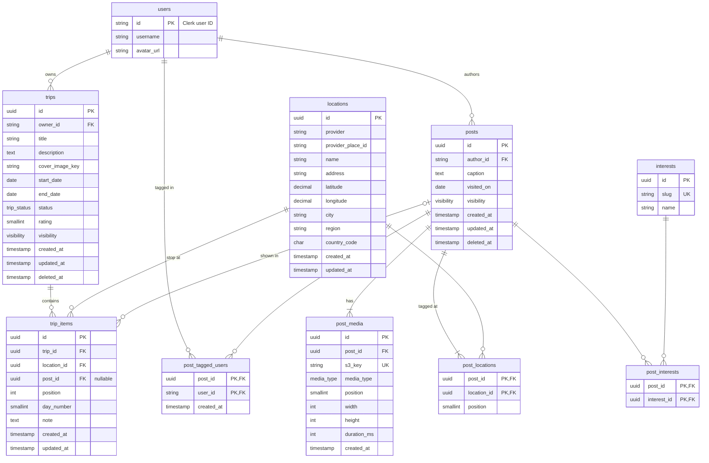

# Itinerary Schema: Trips, Posts, Locations

Status: Draft, for review
Issue: #3

## Overview

This doc proposes the data model and API contracts for trips, posts, and locations. Itinerary building, the feed, and maps all read from these tables.

Related work:
- #4 Auth/Users: has and defines `users`. Every table here references `users.id`.
- #10 Follower System: defines follows. Visibility rules below depend on it.
- #8 Post creation UI, #9 Trip creation UI, #12 Feed UI: the screens these contracts need to support.
- #6 Maps: picks the place provider that `locations` is populated from.

Conventions follow the auth doc: snake_case columns, camelCase JSON, UUID primary keys, endpoints under `/api`, and every endpoint requires a valid Clerk session. The one exception is `users.id`, which is the Clerk user ID (a string like `user_123`), so every column that references a user is a string, not a UUID.

## Relationships



`users` is owned by #4. Only the fields this doc uses are shown.

A post is something a user shares about one or more places: photos, a caption, and the locations it covers. A post can exist without a trip.

A trip is an ordered list of trip items. Each item is a location, and may also point to a post about that location. This lets a trip contain:
- places the owner has posted about (item has a post),
- places the owner plans to go but hasn't posted about yet (item has no post),
- places or posts saved from someone else's content in the feed (item points to another user's post).

Because of this, trips and posts are many-to-many through `trip_items`. The same post can appear in several trips, including trips owned by other users.

## Data Model

### Enums

| Enum | Values |
|---|---|
| `visibility` | `public`, `followers`, `private` |
| `trip_status` | `planned`, `completed` |
| `media_type` | `image`, `video` |

### locations

A shared record for a real-world place. Locations are deduplicated by provider place ID, so every post about the same place points to the same row. That shared row is what lets maps and the feed group content by place.

Places come from an external place search API (chosen in #6), and `provider_place_id` is that API's ID for the place. Those IDs are only unique within one provider, so we store `provider` next to them. That way, switching providers later, or using a second one, doesn't cause ID collisions or require a migration.

| Field | Type | Nullable | Default | Constraints | Description |
|---|---|---|---|---|---|
| `id` | UUID | No | Generated | Primary key | |
| `provider` | String | No | — | Unique with `provider_place_id` | Place data source, e.g. `google`, `mapbox` (pending #6) |
| `provider_place_id` | String | No | — | Unique with `provider` | Provider's ID for the place |
| `name` | String | No | — | | Display name, e.g. "Tartine Bakery" |
| `address` | String | Yes | `NULL` | | Formatted address |
| `latitude` | Decimal(9,6) | No | — | -90 to 90 | |
| `longitude` | Decimal(9,6) | No | — | -180 to 180 | |
| `city` | String | Yes | `NULL` | | |
| `region` | String | Yes | `NULL` | | State or province |
| `country_code` | Char(2) | Yes | `NULL` | ISO 3166-1 alpha-2 | |
| `created_at` | Timestamp | No | Current timestamp | | |
| `updated_at` | Timestamp | No | Current timestamp | | |

Indexes: `(provider, provider_place_id)` unique, `(latitude, longitude)` for map queries. If map queries need radius search we can move to PostGIS later.

### trips

| Field | Type | Nullable | Default | Constraints | Description |
|---|---|---|---|---|---|
| `id` | UUID | No | Generated | Primary key | |
| `owner_id` | String | No | — | FK `users.id` | Trip creator |
| `title` | String(100) | No | — | | |
| `description` | Text | Yes | `NULL` | | |
| `cover_image_key` | String | Yes | `NULL` | | S3 key of cover image |
| `start_date` | Date | Yes | `NULL` | | |
| `end_date` | Date | Yes | `NULL` | `end_date >= start_date` | |
| `status` | `trip_status` | No | `planned` | | |
| `rating` | Smallint | Yes | `NULL` | 1 to 5, only when `status = completed` | Owner's overall rating of the trip |
| `visibility` | `visibility` | No | `public` | | |
| `created_at` | Timestamp | No | Current timestamp | | |
| `updated_at` | Timestamp | No | Current timestamp | | |
| `deleted_at` | Timestamp | Yes | `NULL` | | Soft delete |

Indexes: `(owner_id, created_at)`.

Check constraint: `rating IS NULL OR status = 'completed'`. Moving a trip back to `planned` clears its rating.

### trip_items

One stop in a trip's itinerary.

| Field | Type | Nullable | Default | Constraints | Description |
|---|---|---|---|---|---|
| `id` | UUID | No | Generated | Primary key | |
| `trip_id` | UUID | No | — | FK `trips.id`, on delete cascade | |
| `location_id` | UUID | No | — | FK `locations.id` | The place for this stop |
| `post_id` | UUID | Yes | `NULL` | FK `posts.id` | Post shown for this stop, if any. Can belong to any user. |
| `position` | Integer | No | — | Unique with `trip_id` | Order within the trip, starting at 0 |
| `day_number` | Smallint | Yes | `NULL` | `>= 1` | Optional day grouping ("Day 2") |
| `note` | Text | Yes | `NULL` | | Trip owner's note for this stop |
| `created_at` | Timestamp | No | Current timestamp | | |
| `updated_at` | Timestamp | No | Current timestamp | | |

Constraints:
- `(post_id, location_id)` is a composite FK to `post_locations(post_id, location_id)`. When `post_id` is set, the item's location has to be one of that post's locations. When `post_id` is null, Postgres skips the check.
- The `(trip_id, position)` unique constraint should be `DEFERRABLE INITIALLY DEFERRED` so a reorder can swap positions in one transaction.

Indexes: `(trip_id, position)` unique, `(post_id)`.

### posts

| Field | Type | Nullable | Default | Constraints | Description |
|---|---|---|---|---|---|
| `id` | UUID | No | Generated | Primary key | |
| `author_id` | String | No | — | FK `users.id` | |
| `caption` | Text | Yes | `NULL` | Max 2,200 chars | |
| `visited_on` | Date | Yes | `NULL` | | When the experience happened, if different from `created_at` |
| `visibility` | `visibility` | No | `public` | | |
| `created_at` | Timestamp | No | Current timestamp | | |
| `updated_at` | Timestamp | No | Current timestamp | | |
| `deleted_at` | Timestamp | Yes | `NULL` | | Soft delete |

Indexes: `(author_id, created_at)`.

A post must have at least one location and at least one media item. The API enforces this, since the database can't express it on its own.

### post_locations

| Field | Type | Nullable | Default | Constraints | Description |
|---|---|---|---|---|---|
| `post_id` | UUID | No | — | FK `posts.id`, on delete cascade | |
| `location_id` | UUID | No | — | FK `locations.id` | |
| `position` | Smallint | No | — | Unique with `post_id` | Display order of locations on the post |

Primary key: `(post_id, location_id)`. Index: `(location_id)` for "all posts at this place".

### post_media

| Field | Type | Nullable | Default | Constraints | Description |
|---|---|---|---|---|---|
| `id` | UUID | No | Generated | Primary key | |
| `post_id` | UUID | No | — | FK `posts.id`, on delete cascade | |
| `s3_key` | String | No | — | Unique | Object key in the media bucket |
| `media_type` | `media_type` | No | — | | |
| `position` | Smallint | No | — | Unique with `post_id` | Carousel order |
| `width` | Integer | Yes | `NULL` | | Pixels |
| `height` | Integer | Yes | `NULL` | | Pixels |
| `duration_ms` | Integer | Yes | `NULL` | | Video only |
| `created_at` | Timestamp | No | Current timestamp | | |

We store S3 keys, not URLs. The API returns signed or CDN URLs when it reads a post.

### post_tagged_users

Users tagged as having been there with the author (from #8).

| Field | Type | Nullable | Default | Constraints | Description |
|---|---|---|---|---|---|
| `post_id` | UUID | No | — | FK `posts.id`, on delete cascade | |
| `user_id` | String | No | — | FK `users.id`, on delete cascade | |
| `created_at` | Timestamp | No | Current timestamp | | |

Primary key: `(post_id, user_id)`.

### interests

A fixed list of interest tags, like `food`, `hiking`, `nightlife`, and `museums`. The list is seeded by a migration, and users can't create new ones. We use a fixed list instead of free-text hashtags so posts can be grouped and filtered reliably, and so #5 (trip-surfacing) has a clean signal to match users to content.

| Field | Type | Nullable | Default | Constraints | Description |
|---|---|---|---|---|---|
| `id` | UUID | No | Generated | Primary key | |
| `slug` | String(50) | No | — | Unique | Stable identifier, e.g. `food` |
| `name` | String(50) | No | — | | Display label, e.g. "Food & Drink" |

### post_interests

| Field | Type | Nullable | Default | Constraints | Description |
|---|---|---|---|---|---|
| `post_id` | UUID | No | — | FK `posts.id`, on delete cascade | |
| `interest_id` | UUID | No | — | FK `interests.id` | |

Primary key: `(post_id, interest_id)`. Index: `(interest_id)`. A post can have 0 to 5 interests.

### Deletion

Trips and posts are soft deleted by setting `deleted_at`. Reads treat a soft-deleted row as missing:
- A deleted trip returns 404.
- A trip item whose post was deleted stays in the trip as a plain location, and `post` comes back as `null`.

Hard deletes, for example on account deletion (see #4), cascade as described in the tables above.

## Visibility

Trips and posts each have their own `visibility`. A post's visibility does not change based on which trips it appears in, and a trip's visibility does not change its posts.

`canView(viewer, ownerId, visibility)`:

| Visibility | Who can see it |
|---|---|
| `public` | Any signed-in user |
| `followers` | The owner, and users who follow the owner (a row in #10's follows table with `follower_id = viewer` and `following_id = owner`) |
| `private` | Only the owner |

Rules:
1. `GET /api/trips/:id` returns 404 if the viewer can't see the trip. We return 404 instead of 403 so we don't reveal that the trip exists.
2. Inside a visible trip, every item's location is returned. An item's `post` is returned only if the viewer can see that post, and is `null` otherwise. So a public trip that includes someone's followers-only post shows that stop's place but not the post.
3. `GET /api/posts/:id` follows the same rule, based on the post's own visibility. Visibility depends only on the author. Being tagged in a post doesn't give a user access to it.
4. Lists (a user's trips, a user's posts, posts at a location) only include rows the viewer can see.
5. Only the owner can edit or delete a trip or its items, and only the author can edit or delete a post. A visible but not owned resource returns 403.
6. Adding someone else's post to your trip requires that you can see the post at that moment. If the author later makes the post more restrictive, rule 2 hides it from viewers who no longer qualify.

If #10 adds follow requests or blocking, `canView` should count only accepted follows and exclude blocked users. No schema change is needed here for that.

## API Contracts

All endpoints require authentication. The current user comes from the auth middleware in #4, never from the request body.

Errors use NestJS's default shape:

```json
{ "statusCode": 404, "message": "Trip not found", "error": "Not Found" }
```

List endpoints use cursor pagination: `?cursor=<opaque>&limit=<1-50, default 20>` returns `{ "items": [...], "nextCursor": "..." | null }`.

### Shared response shapes

`UserSummary` (fields from #4's `User`):
```json
{ "id": "user_123", "username": "duke", "avatarUrl": "https://..." | null }
```

`Location`:
```json
{
  "id": "uuid",
  "name": "Tartine Bakery",
  "address": "600 Guerrero St, San Francisco, CA 94110",
  "latitude": 37.761392,
  "longitude": -122.424048,
  "city": "San Francisco",
  "region": "CA",
  "countryCode": "US"
}
```

`Post`:
```json
{
  "id": "uuid",
  "author": UserSummary,
  "caption": "Best morning bun in the city",
  "visitedOn": "2026-09-20",
  "visibility": "public",
  "locations": [ Location ],
  "media": [
    { "id": "uuid", "mediaType": "image", "url": "https://...", "width": 1080, "height": 1350, "durationMs": null }
  ],
  "taggedUsers": [ UserSummary ],
  "interests": [ Interest ],
  "createdAt": "2026-09-29T12:00:00Z",
  "updatedAt": "2026-09-29T12:00:00Z"
}
```

`Interest`:
```json
{ "id": "uuid", "slug": "food", "name": "Food & Drink" }
```

`TripSummary` (used in lists):
```json
{
  "id": "uuid",
  "owner": UserSummary,
  "title": "SF Weekend",
  "coverImageUrl": "https://...",
  "startDate": "2026-09-19",
  "endDate": "2026-09-21",
  "status": "completed",
  "rating": 4,
  "visibility": "public",
  "itemCount": 6,
  "createdAt": "2026-09-22T12:00:00Z"
}
```

`Trip` (detail) has every `TripSummary` field, plus:
```json
{
  "description": "Food-focused weekend in the Mission",
  "items": [ TripItem ]
}
```

`TripItem`:
```json
{
  "id": "uuid",
  "position": 0,
  "dayNumber": 1,
  "note": "Get there before 9",
  "location": Location,
  "post": Post | null
}
```

### Media

Media goes straight from the client to S3 through a presigned URL. The post then references the uploaded keys.

`POST /api/media/uploads`

Request:
```json
{ "mediaType": "image", "contentType": "image/jpeg", "fileSize": 2483021 }
```

Response `201`:
```json
{ "s3Key": "posts/uuid/uuid.jpg", "uploadUrl": "https://...", "expiresAt": "2026-09-29T12:15:00Z" }
```

### Locations

`POST /api/locations`: find or create a location from a provider place. The server looks up the place details from the provider and doesn't trust client-supplied coordinates.

Request:
```json
{ "provider": "google", "providerPlaceId": "ChIJ..." }
```

Response `200` if it already existed, `201` if created: `Location`.

`GET /api/locations/:id`: returns `Location`.

`GET /api/locations/:id/posts`: paginated `Post` list of visible posts tagged with this location, newest first.

### Interests

`GET /api/interests`: returns the full list, `{ "items": [ Interest ] }`. It isn't paginated because the list is small and fixed.

### Posts

`POST /api/posts`

Request:
```json
{
  "caption": "Best morning bun in the city",
  "visitedOn": "2026-09-20",
  "visibility": "public",
  "locationIds": ["uuid"],
  "media": [
    { "s3Key": "posts/uuid/uuid.jpg", "mediaType": "image", "width": 1080, "height": 1350 }
  ],
  "taggedUserIds": ["user_123"],
  "interestIds": ["uuid"],
  "tripId": "uuid"
}
```

- `locationIds`: required, 1 to 10, in display order.
- `media`: required, 1 to 10, in display order. Each `s3Key` must come from an upload by the same user.
- `interestIds`: optional, 0 to 5.
- `tripId`: optional. If set, the caller must own the trip, and one trip item is appended per location. This supports the "save to trip" step in #8.

Response `201`: `Post`.

`GET /api/posts/:id`: returns `Post`.

`PATCH /api/posts/:id`: author only. Any of `caption`, `visitedOn`, `visibility`, `locationIds`, `media`, `taggedUserIds`, `interestIds`. Arrays replace the existing list. Removing a location also removes the matching trip items that point to this post, so the composite FK stays valid. Response `200`: `Post`.

`DELETE /api/posts/:id`: author only, soft delete. Response `204`.

`GET /api/users/:userId/posts`: paginated `Post` list, newest first.

### Trips

`POST /api/trips`

Request:
```json
{
  "title": "SF Weekend",
  "description": "Food-focused weekend in the Mission",
  "startDate": "2026-09-19",
  "endDate": "2026-09-21",
  "status": "planned",
  "visibility": "public",
  "coverImageKey": null
}
```

Only `title` is required. Response `201`: `Trip` with empty `items`.

`GET /api/trips/:id`: returns `Trip` with items ordered by `position`.

`PATCH /api/trips/:id`: owner only. Any of the fields from create, plus `rating` (1 to 5). Setting `rating` on a trip that isn't `completed` returns 400. Response `200`: `Trip`.

`DELETE /api/trips/:id`: owner only, soft delete. Response `204`.

`GET /api/users/:userId/trips`: paginated `TripSummary` list. Optional `?status=planned|completed`.

### Trip items

All trip item endpoints are owner only.

`POST /api/trips/:id/items`

Request:
```json
{ "locationId": "uuid", "postId": "uuid", "dayNumber": 1, "note": "Get there before 9", "position": 2 }
```

- `locationId`: required.
- `postId`: optional. It can be any post the caller can see, and `locationId` must be one of its locations.
- `position`: optional. Defaults to the end. If given, the items at or after it shift down.

Response `201`: `TripItem`.

`PATCH /api/trips/:id/items/:itemId`: any of `dayNumber`, `note`, `postId`. Response `200`: `TripItem`.

`DELETE /api/trips/:id/items/:itemId`: removes the item and closes the gap in positions. Response `204`.

`PUT /api/trips/:id/items/order`: reorders the whole list in one call, for drag-and-drop in #9.

Request:
```json
{ "itemIds": ["uuid", "uuid", "uuid"] }
```

The request must include every item in the trip exactly once. Response `200`: `{ "items": [ TripItem ] }`.
